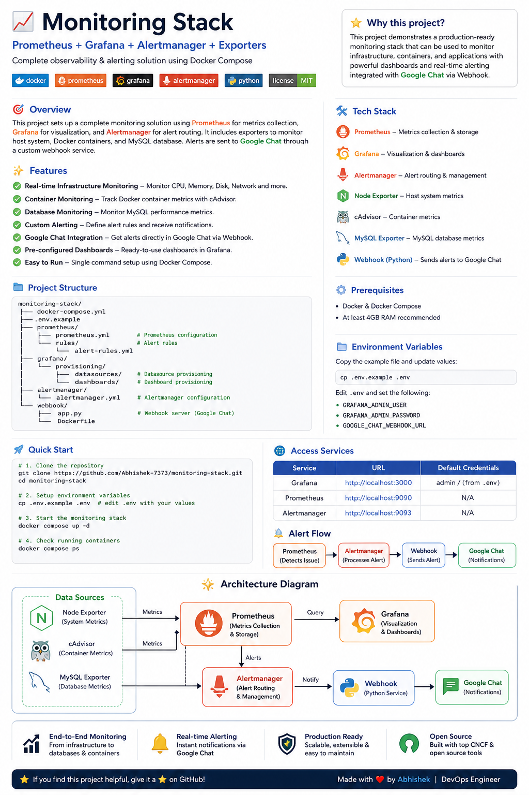

# 🚀 Monitoring Stack (Prometheus + Grafana + Alertmanager)



---

## 📌 Project Overview

This project demonstrates a **production-grade monitoring and alerting system** built using modern DevOps tools.

It provides **end-to-end observability** for:
- 🖥️ Infrastructure (CPU, Memory, Disk, Network)
- 📦 Docker containers
- 🗄️ Database performance (MySQL)
- 🚨 Real-time alerting via webhook integration (Google Chat)

The entire setup is containerized using Docker Compose, making it **portable, scalable, and easy to deploy**.

---

## 🎯 Key Highlights

- ✅ Real-time infrastructure monitoring  
- 📦 Container-level metrics using cAdvisor  
- 📊 Grafana dashboards for visualization  
- 🚨 Alerting using Prometheus + Alertmanager  
- 🔗 Webhook integration for notifications  
- 🔐 Secure configuration using `.env`  
- 🧩 Modular and production-ready design  

---

## 🧭 Architecture Flow

```
Linux Host / Docker Containers
        ↓
Node Exporter / cAdvisor / MySQL Exporter
        ↓
Prometheus (Metrics Collection & Storage)
        ↓
Grafana (Visualization & Dashboards)
        ↓
Alertmanager (Alert Routing)
        ↓
Webhook Service (Python)
        ↓
Google Chat Notifications
```

## 🏗️ Architecture Explanation

### 🔹 Exporters Layer
- **Node Exporter** → System-level metrics (CPU, Memory, Disk)
- **cAdvisor** → Container-level metrics
- **MySQL Exporter** → Database metrics

---

### 🔹 Monitoring Layer
- **Prometheus**
  - Scrapes metrics from exporters
  - Stores time-series data
  - Evaluates alert rules

---

### 🔹 Visualization Layer
- **Grafana**
  - Connects to Prometheus
  - Displays dashboards
  - Uses pre-provisioned configurations

---

### 🔹 Alerting Layer
- **Alertmanager**
  - Receives alerts from Prometheus
  - Handles routing and grouping

---

### 🔹 Integration Layer
- **Webhook Service**
  - Receives alerts
  - Sends notifications to Google Chat

---

## 🛠️ Tech Stack

| Category        | Tools |
|----------------|------|
| Monitoring     | Prometheus |
| Visualization  | Grafana |
| Alerting       | Alertmanager |
| Exporters      | Node Exporter, cAdvisor, MySQL Exporter |
| Containerization | Docker, Docker Compose |
| Integration    | Python Webhook |
| Notifications  | Google Chat |

---

## 📂 Project Structure

```
monitoring-stack/
├── docker-compose.yml
├── architecture.png
├── .env.example
├── prometheus/
│   ├── prometheus.yml
│   └── rules/
│       └── alerts.yml
├── alertmanager/
│   └── alertmanager.yml
├── grafana/
│   └── provisioning/
│       ├── datasources/
│       └── dashboards/
├── webhook/
│   ├── app.py
│   ├── Dockerfile
│   └── requirements.txt
```

## ⚙️ Prerequisites

- Docker
- Docker Compose
- Minimum 2GB RAM (4GB recommended)

---

## 🚀 Setup & Installation

### 1️⃣ Clone Repository

```bash
git clone https://github.com/Abhishek-7373/monitoring-stack.git
cd monitoring-stack
```

---

### 2️⃣ Configure Environment Variables

```bash
cp .env.example .env
```

Edit `.env`:

```env
GRAFANA_ADMIN_USER=admin
GRAFANA_ADMIN_PASSWORD=StrongPassword
GOOGLE_CHAT_WEBHOOK=your_webhook_url
```

---

### 3️⃣ Start the Monitoring Stack

```bash
docker compose up -d
```

---

### 4️⃣ Verify Running Containers

```bash
docker ps
```

---

## 🌐 Access Services

| Service        | URL |
|----------------|-----|
| Grafana        | http://localhost:3000 |
| Prometheus     | http://localhost:9090 |
| Alertmanager   | http://localhost:9093 |

---

## 📊 Grafana Dashboards

Pre-configured dashboards provide insights into:

- CPU usage  
- Memory usage  
- Container performance  
- System health  

---

## 🚨 Alerting Workflow

```
Prometheus detects issue
        ↓
Alertmanager processes alert
        ↓
Webhook receives alert
        ↓
Google Chat notification sent
```

---

## 🔐 Security Best Practices

- `.env` excluded using `.gitignore`
- No credentials stored in source code
- Webhook URLs kept private

Supports upgrade to:
- Docker Secrets  
- AWS Secrets Manager  
- HashiCorp Vault  

---

## 🧪 Testing the Setup

Simulate CPU load:

```bash
docker run --rm -it progrium/stress --cpu 2 --timeout 60s
```

Observe:

- Grafana dashboards update  
- Alerts trigger (if configured)  

---

## 🎯 Use Case

This project simulates a **real-world DevOps monitoring system** used in production to:

- Monitor infrastructure  
- Track container health  
- Detect anomalies  
- Send real-time alerts  

---

## 🚀 Future Improvements

- Kubernetes deployment  
- CI/CD integration  
- Advanced alert routing  
- Centralized logging (ELK stack)  

---

## 👨‍💻 Author

**Abhishek – DevOps Engineer**

---

## ⭐ Support

If you found this useful:

- ⭐ Star the repo  
- 🔁 Share it  
- 💬 Give feedback  
